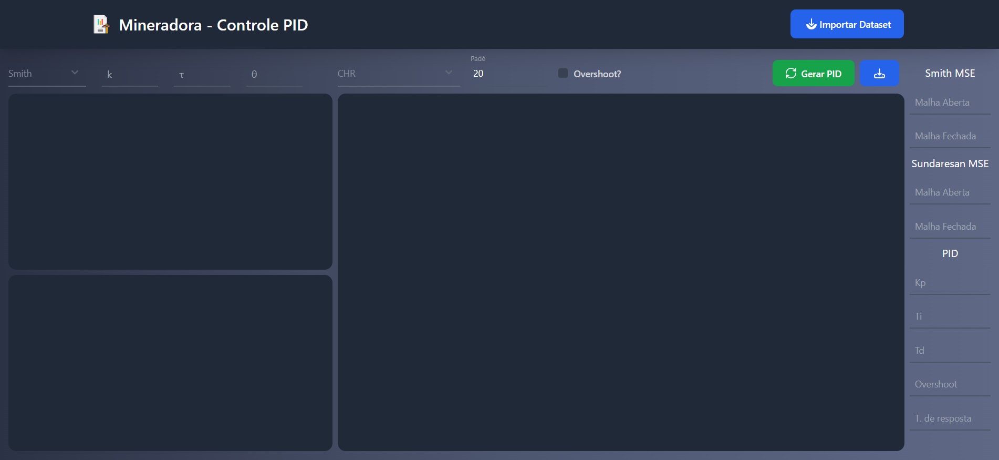
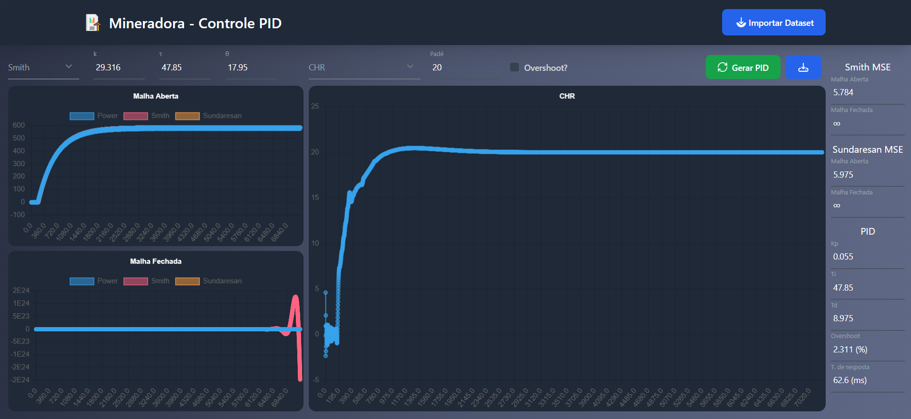
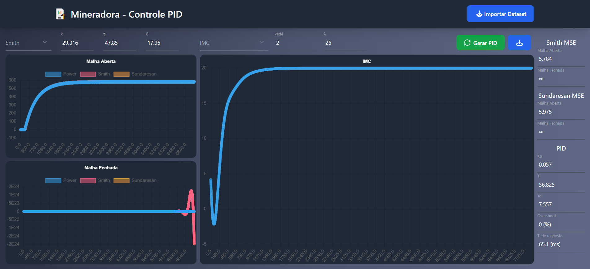
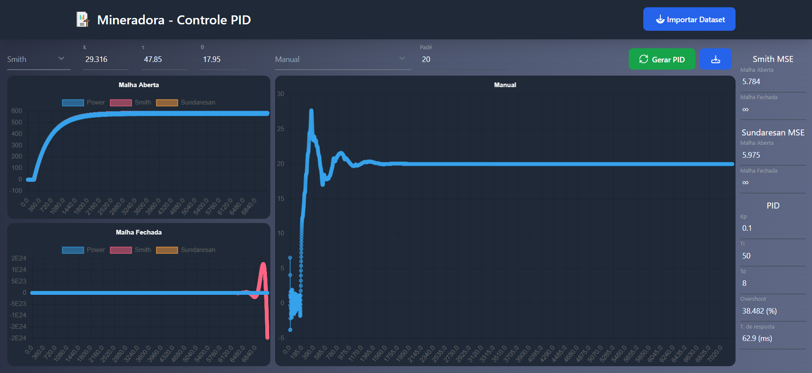

# Controle-PID

## Identificação de Processos e Sintonia de Controladores PID
### Controle de Processos Remotos com Atraso de Propagação

Esse projeto é uma implementação de um controle de Indentificação de Processos e Sintonia de Controladores PID para um motor W22 Mining que é responsável por movimentar materiais em uma mineradora.

O dataset se encontra na pasta:
```bash
static\datasets
```

### Funcionalidades
- Identificação de Processos.
  - Métodos
    - Smith
    - Sundaresan
  - Seleção do método de identificação de processo
  - Erro quadrático médio dos método
  - Gráfico de comparação
    - Malha aberta
    - Malha fechada
- Aproximação de Padé.
  - Escolha do valor para a aproximação de Padé
- Sintonia de Controladores PID.
  - Métodos
    - Ziegler Nichols
    - IMC
      - Escolha do valor de lambda para o método IMC
    - CHR
    - CHR com 20% de sobrevalor
    - Cohen e Coon
    - ITAE
    - Manual
      - Escolha dos valores de Kp, Ti e Td (Apenas para o método manual)
  - Seleção do método de sintonia do controlador PID
  - Overshoot do método escolhido
  - Tempo de resposta do método escolhido

### Home


### CHR


### IMC com aproximação de Padé diferente do ideal


### Mudança manual dos parâmetros Kp, Ti e Td


## Tecnologias utilizadas
- Python, Flask e SocketIO para o backend
- HTML, CSS, Tailwind CSS, Jinja2, JavaScript e ChartsJs para o frontend

## Pré-requisitos

- [Python 3.12.1](https://www.python.org/downloads/release/python-3121/) ou superior

## Instalação
Faça o clone do repositório:

```bash
git clone https://github.com/ArthurBuenoSilva/Controle-PID.git
```

Acesse a pasta onde você clonou o repositório:

```bash
cd caminho/para/o/projeto
```

Crie um ambiente virtual(venv):

```bash
python -m venv venv
```

Acesse o ambiente virtual criado:

```bash
venv/Scripts/activate
```

Instale as dependências necessárias:
```bash
pip install -r requirements.txt
```

## Uso
Agora execute o script main.py:

```bash
python main.py
```

No terminal deve aparecer uma mensagem parecida com essa:

```bash
 * Serving Flask app 'app'
 * Debug mode: off
WARNING: This is a development server. Do not use it in a production deployment. Use a production WSGI server instead.
 * Running on http://127.0.0.1:49675
Press CTRL+C to quit
```

Agora que o servidor já está em execução, abra o navegador e acesse a URL exibida no terminal.

No meu caso, a URL seria http://127.0.0.1:49675.

## Contribuições

Solicitações de pull requests são bem-vindas. Para mudanças importantes, abra uma issue primeiro para discutir o que você gostaria de mudar.

## Licença

[MIT](https://choosealicense.com/licenses/mit/)